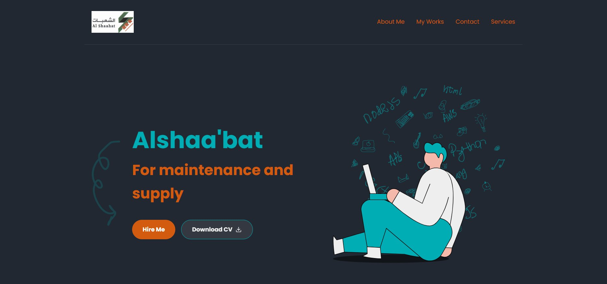

# Alshaa'bat — Maintenance and Supply

موقع مؤسسة الشعبات للصيانة والتجهيز.



## محتويات المشروع

| الملف | الوصف |
|------|------|
| `index.html` | الصفحة الرئيسية (Alshaa'bat) |
| `maintenance.html` | صفحة خدمات الصيانة |
| `SpareParts.html` | صفحة قطع الغيار |
| `Supply.html` | صفحة التجهيز والتوريد |
| `AlShaahat_Final.pdf` | ملف PDF (CV / بروفايل) للتحميل من زر "Download CV" |
| `preview.png` | لقطة شاشة للموقع |

## ⚠️ ملفات ناقصة لازم ترفعها معاك

الـ HTML يستدعي أصول (CSS / صور / أيقونات) مو موجودة في المرفقات. عشان الموقع يشتغل صح على GitHub Pages، تأكد إنك ترفع الملفات التالية بنفس الأسماء:

### 1. ملف الـ CSS
- `styles.css` — يلزم يكون في نفس مجلد ملفات HTML

### 2. صور (في نفس المجلد)
- `Alshaa'bat.png` — شعار المؤسسة (يظهر في الـ header)
- `Supply.png`
- `maintenanc.png` *(لاحظ: بدون e في آخرها — كذا مكتوبة داخل الـ HTML)*
- `spare parts.png` *(بمسافة)*

### 3. أيقونات SVG
الـ HTML يشير لها بالمسار `../svg/` يعني مجلد `svg` خارج مجلد المشروع. لو حابب تخليها في نفس المجلد، عدّل المسارات داخل ملفات HTML من `../svg/` إلى `svg/`. الملفات المطلوبة:
- `AboutMe.svg`
- `Hero.svg`
- `arrow.svg`
- `download.svg`
- `email.svg`
- `lightbulb.svg`
- `phone.svg`

## رفع المشروع على GitHub

```bash
git init
git add .
git commit -m "Initial commit - Alshaa'bat website"
git branch -M main
git remote add origin https://github.com/USERNAME/REPO.git
git push -u origin main
```

## تفعيل GitHub Pages

1. روح للمستودع على GitHub → **Settings** → **Pages**
2. تحت **Source** اختر **Deploy from a branch**
3. اختر `main` والمجلد `/ (root)` ثم اضغط **Save**
4. الموقع راح يكون متاح خلال دقايق على: `https://USERNAME.github.io/REPO/`

## ملاحظة

أعدت تسمية `__AlShaahat_Final.pdf` إلى `AlShaahat_Final.pdf` (بدون شرطتين سفليتين) عشان يطابق الرابط الموجود داخل HTML (`href="AlShaahat_Final.pdf"`).

كذلك أعدت تسمية `Alshaa_bat.html` إلى `index.html` عشان GitHub Pages يفتحه تلقائياً كصفحة رئيسية.
